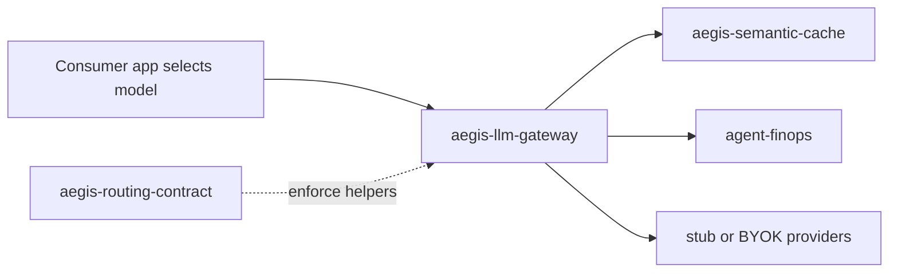

# Architecture — aegis-llm-gateway

OpenAI-shaped LLM proxy for the federated control plane. **Apps select** models; this plane **enforces + records** (ADR-029).

```text
Client → POST /v1/chat/completions
       → optional API key
       → parse RoutingHeaders (tenant, thesis/agent role, data class, …)
       → tenant allowlist check (warn | enforce)
       → enforce_routing_policy (confidential→private, verifier≠generator)
       → FinOps budget pre-check (optional)
       → semantic-cache lookup (verifiers bypass)
       → stub | BYOK provider
       → cache store on miss
       → FinOps meter (optional)
       → record RoutingDecisionV2 → GET /v1/ops/routing-decisions
```



## Modes

| Mode | Behavior |
|------|----------|
| stub (default) | Deterministic completion; no paid keys |
| byok | Live providers when keys present (`GATEWAY_MODE=byok`) |
| control_plane_mode=strict | Fail-closed: FinOps down → 503; budget breached → 402 |
| control_plane_mode=demo | Fail-open with warnings in `gateway.finops` (explicit toggle) |
| TENANT_ENFORCEMENT=warn | Unknown tenants logged; allowed through (Render default) |
| TENANT_ENFORCEMENT=enforce | Unknown tenants → HTTP 403 |

## FinOps flow

1. Optional pre-check `GET {AGENTFINOPS_URL}/v1/budget/tenant/{tenant}`
2. Cache lookup → stub/BYOK completion on miss
3. Meter `POST /v1/usage` with `X-API-Key` when configured
4. Annotate response `gateway.finops` (precheck + meter)

See `GET /v1/posture` for machine-readable honesty and [DEPLOY_WIRING.md](DEPLOY_WIRING.md) for live URLs.

## Non-goals

- Model **selection** system of record (apps / Multi-LLM brains)
- Tool HITL / OPA (AegisAI)
- In-process semantic cache (aegis-semantic-cache)
